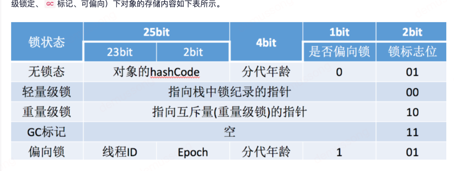

### problems list
1. ForkJoinPool原理和实现？
2. synchronized和reentrantLock区别?并发量少的时候哪个性能更高？
3. synchronized并发量很高的情况下会有什么问题呢？如何解决？
4. 通过什么命令可以设置禁止偏向锁？(-XX:-UseBiasedLocking)
   //关闭延迟开启偏向锁
   -XX:BiasedLockingStartupDelay=0
   //禁止偏向锁
   -XX:-UseBiasedLocking
   //启用偏向锁
   -XX:+UseBiasedLocking
5. 为什么volatile修饰的变量都在类里，而不去修饰局部变量呢？
6. synchronized锁状态升级过程、CAS原理
7. ReentrantLock和AQS源码，state状态变量与 CountDownLatch 的联系等
8. volatile关键字原理？为什么volatile修饰的变量都在类里，而不去修饰局部变量呢？
9. 有3个操作 a b c，希望a和b执行完后 c再执行（Object类下的wait() & notify()，CountDownLatch，ReentrantLock的await() & signal()）
10. 使用线程池，设置线程数的依据是什么
11. synchronized为什么设计为可重入锁
12. 你怎么理解可重入锁
13. 非公平锁吞吐量为什么比公平锁大
14. 关闭线程池shutdown和shutdownnow区别
15. 9、线程池参数，默认用的是什么阻塞队列【linkedblockingQueue】，FixedThreadPool这种使用的是什么阻塞队列
16. final
17. wait sleep区别
18. 

### reference answer
1.forkjoinpool适合执行大规模并行任务，特别是那些可以递归分解为更小任务的计算密集型任务。
ForkJoinPool实现了工作窃取算法，当一个线程的任务队列为空时，它可以从其他线程的队列中窃取任务来执行。
这种设计使得ForkJoinPool在处理大量小任务时，能够更好地利用CPU资源，减少线程间的竞争。
而普通线程池适合执行大量独立的任务。比如求和从1加到10000，递归分解为小任务，当数组元素个数小于100时就是一个任务。
2.synchronized是jvm层次的，和Lock比，不支持超时，打断，公平锁。
3.synchronized是Java中的一个关键字，用于控制并发访问共享资源，保证线程安全。然而，在并发量很高的情况下，使用synchronized可能会导致以下问题：

性能下降：当一个线程访问一个synchronized同步块或方法时，其他所有试图访问这个同步块或方法的线程都会被阻塞，直到第一个线程释放锁。这会导致大量的线程阻塞，从而降低系统的整体性能。

死锁：如果两个或更多的线程在互相等待对方释放锁，就可能会发生死锁。这种情况下，涉及的所有线程都无法继续执行。

饥饿：由于Java的内置锁是不公平的，因此在高并发的情况下，有可能出现某些线程长时间获取不到锁的情况，也就是所谓的"饥饿"现象。

解决这些问题的方法有很多，以下是一些常见的策略：

减少锁的粒度：尽量只在必要的地方使用synchronized，并尽可能缩小同步块的范围。这样可以减少线程阻塞的可能性，提高系统的并发性能。

使用并发工具类：Java的java.util.concurrent包提供了许多并发工具类，如ReentrantLock、Semaphore、CountDownLatch等。这些工具类提供了比synchronized更灵活的并发控制机制。

避免死锁：避免死锁的一个常见策略是按照一定的顺序获取锁，这样可以防止循环等待的发生。

使用线程池：通过使用线程池，可以控制并发线程的数量，避免过多的线程竞争资源，从而提高系统的性能。

使用分布式锁：如果是在分布式系统中，可以考虑使用分布式锁，如Zookeeper、Redis等提供的分布式锁。
5.局部变量不能被多线程共享
6.
(1)轻量级锁
轻量级锁使用场景：当一个对象被多个线程所访问，但访问的时间是错开的（不存在竞争），此时就可以使用轻量级锁来优化。
7.再看一下AQS基本原理，和相关类如何用aqs实现的

11.会造成死锁
13.公平锁会按照线程的请求顺序进行排队，确保等待时间最长的线程优先获取锁。这种排队机制可能会导致更多的上下文切换和竞争，从而降低了吞吐量
非公平锁会尝试立即将锁分配给等待的线程，而不会按照先后顺序进行排队。这意味着当前持有锁的线程有机会再次获取锁，从而避免了其他线程的上下文切换和竞争。

todo final volatile原理
