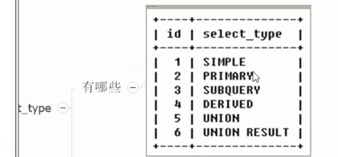

### problems list
1. mySQL存储引擎用的什么？横向对比一下其他几个存储引擎
2. mySQL默认隔离级别是什么？
3. 有个学生表，select * for update ，条件是age＞18，分析一下加锁情况？
4. 间隙锁原理
5. mySQL5.6和8.0区别
6. 如何实现mySQL读写分离
7. mySQL如何优化索引,explain命令作用？
8. mySQL隔离级别，解决了什么问题？
9. mySQL乐观锁悲观锁介绍一下？
10. 大key问题你如何解决的，结合实习的场景
11. 100万数据量的情况下mySQL分页怎么查询数据？说一下SQL语句怎么写,OFFSET的底层原理是什么，如何实现的？
12. MySQL执行关键字的顺序？
13. 介绍一爱MySQL隔离级别和相应解决的问题？
14. 介绍一下MVCC？
15. 索引失效场景
16. MySQL行数多了为什么会变慢,加索引为什么会快,有处理过慢查询吗
17. 用索引之后，哪些方面的性能会得到大幅度的提升
18. explain分析后， type的执行效率等级，达到什么级别比较合适
19. undolog，redolog，binlog？都是在什么时候被记录？
20. Mysql中Drop、delete、truncate的区别
21. 项目场景题：订单数量达到千万级读写/存储性能下降，有哪些解决策略,水平分表用什么字段去哈希,怎么分库
22. 什么时候分库分表
23. 什么时候用分库分表，什么时候用分布式数据库
24. 数据库死锁，解决办法
25. 17，Mysql的Online DDL（√）
26. 18，独立表空间（√）
27. 19，索引结构，页格式，行格式。（√）
28. 9，一条sql很慢，怎么去排查？（√）
29. 10，一条查询/更新sql他的执行流程？（√）
30. 14、Mysql中什么时候不建议使用索引
31. 索引覆盖，索引下推是什么？
32. MySQL支持多少并发
33. MySQL引擎，MyISAM没有事务怎么办
34. 哈希索引
35. MySQL实现分布式锁
36. 分区表和分表
37. 哪些情况下适合/不适合建索引

### reference answer
1.(https://www.cnblogs.com/pengpengdeyuan/p/15001739.html)
            支持事务     聚簇索引  行锁表锁    mvcc
innodb        yes         yes      行         yes
myisam         no         no       表锁        no
memory         no         no       表         no        数据完全存在内存，不支持持久性
7.优化
explain

select_type:

type:

一般至少达到range，最好达到ref

key_len:

ref:

rows:

小表驱动大表
order by优化
group by 优化
14.
readview记录活跃事务list的原因是因为可能有类似事务4这样开始晚但结束早的事务
31.索引下推（https://xingliuhua.github.io/posts/mysql_%E7%B4%A2%E5%BC%95%E4%B8%8B%E6%8E%A8/）
MySQL 存储引擎层，先根据过滤条件中包含的索引键确定索引记录区间，再在这个区间的记录上使用包含索引键的其他过滤条件进行过滤，
之后规避掉不满足的索引记录，只根据满足条件的索引记录回表取回数据上传到 MySQL 服务层。默认开启
如果用explain，用了索引下推 extra 里显示 “Using index condition” 就代表用了 ICP。
36.https://www.cnblogs.com/dw3306/p/12620042.html
37.频繁更新字段不适合建立索引，因为同时需要更新数据和索引
