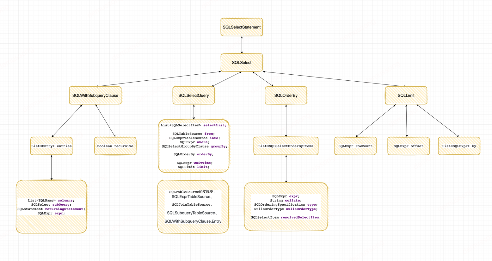

### SQLExpr
1. SQLIdentifierExpr
2. SQLPropertyExpr
3. SQLBinaryOpExpr
4. SQLVariantRefExpr
5. SQLIntegerExpr
6. SQLCharExpr

...后续需要把基本所有的SQLExpr能测试一些有哪些，因为这些SQLExpr构成了AST
举例：
```java
package com.alibaba.druid.sql.ast.expr;

// SQLName是一种的SQLExpr的Expr，包括SQLIdentifierExpr、SQLPropertyExpr等
public interface SQLName extends SQLExpr {}

// 例如 ID = 3 这里的ID是一个SQLIdentifierExpr
class SQLIdentifierExpr implements SQLExpr, SQLName {
    String name;
} 

// 例如 A.ID = 3 这里的A.ID是一个SQLPropertyExpr
class SQLPropertyExpr implements SQLExpr, SQLName {
    SQLExpr owner;
    String name;
} 

// 例如 ID = 3 这是一个SQLBinaryOpExpr
// left是ID (SQLIdentifierExpr)
// right是3 (SQLIntegerExpr)
class SQLBinaryOpExpr implements SQLExpr {
    SQLExpr left;
    SQLExpr right;
    SQLBinaryOperator operator;
}

// 例如 select * from where id = ?，这里的?是一个SQLVariantRefExpr，name是'?'
class SQLVariantRefExpr extends SQLExprImpl { 
    String name;
}

// 例如 ID = 3 这里的3是一个SQLIntegerExpr
public class SQLIntegerExpr extends SQLNumericLiteralExpr implements SQLValuableExpr { 
    Number number;

    // 所有实现了SQLValuableExpr接口的SQLExpr都可以直接调用这个方法求值
    @Override
    public Object getValue() {
        return this.number;
    }
}

// 例如 NAME = 'jobs' 这里的'jobs'是一个SQLCharExpr
public class SQLCharExpr extends SQLTextLiteralExpr implements SQLValuableExpr{
    String text;
}
```

### AST构成

思考遍历AST是前序？中序？
### 几个Visitor
#### 1.SqlRemoveNullParameterConditionScriptArgsVisitor
+ 将非必填，且前端未传值的参数对应的where条件从sql语句中 删除
2、如果配置了参数的reformat语句，则使用reformat直接替换参数占位符
3、对于IN操作符的参数设置了reformat，则每一个参数都替换成reformat并替换到占位符中
#### 2.SQLLineageVisitor
#### 3.InterfaceSQLStructureVisitor
### other
#### 判断是否在where字句中


### todo
整体流程
sql-json
分页查询
多版本
加解密
血缘用来做什么？
